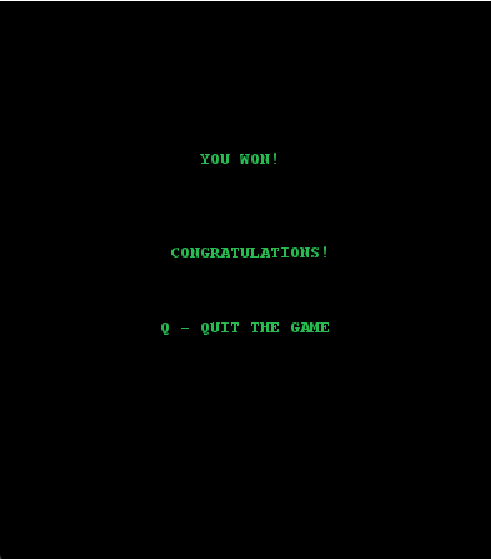

# PROJECT-L12Gr08 - SPACE INVADERS

O jogo desenvolvido representa uma implementação do clássico **Space Invaders**, em java, utilizando o terminal lanterna.
O objetivo do jogo é destruir, com tiros laser, naves inimigas que se movem de um lado de para o outro da arena e disparam balas. Depois de eliminar todas a naves, surge um Boss final, com 10 vidas, que dispara várias bombas de cada vez e se move para baixo quando chega às paredes da arena.
A pontuação do jogador aumenta quando elimina um inimigo, e as suas vidas diminuem se for atingido por uma bomba das naves

## Funcionalidades Implementadas

**Menu Principal :** Quando se inicia o jogo, surge um Menu Principal, com opções para começar a jogar, ver as intruções ou sair.

**Intruções :** Acessível a partir do Menu Principal quando se prime a tecla "I". Mostra o que cada tecla faz no jogo.

**Game Win :** Menu que surge quando o jogador elimina o boss final

**Game Over :** Menu que surge quando o jogador perde todas as vidas. Permite voltar ao jogo com mais 3 vidas se premir a tecla "S"

**Sair do Jogo :** Em qualquer menu e durante o jogo, o jogador pode premir a tecla "Q" para sair do jogo

**Desenho dos elementos com lanterna :**
  - Nave Principal
  - Naves Inimigas
  - Proteções
  - Paredes
  - Laser
  - Tiro
  - Boss
  
**Movimento do Jogador :** Esquerda e direita, com as setas do teclado

**Movimento das Naves Inimigas :** Automaticamente, esquerda e direita até colidirem com uma parede. Quando colidem invertem o sentido

**Movimento do Boss :** Automaticamente, esquerda e direita até colidirem com uma parede. Quando colidem invertem o sentido e descem uma unidade

**Disparo do laser :** com a tecla ENTER

**Movimento do laser :** Da nave principal para cima, até colidir com um inimigo (destruindo-o) ou com as paredes superiores da arena

**Movimento das Balas :** Das naves inimigas para baixo, até colidirem com uma proteção (destruindo-a), com a nave principal (retirando-lhe uma vida) ou com as paredes inferiores da arena

**Atributos do Jogador :** Pontuação e Vidas
  - A pontuação começa a 0 e aumenta em 10 por cada inimigo eliminado
  - As vidas começam a 3 e diminuem em 1 por cada tiro inimigo que atinge o jogador

**Atributos do Boss :** Vidas
  - Quando o Boss fica com 3 vidas, passa a disparar mais tiros de cada vez

**Proteções :** Criação de proteções no início do jogo, que protegem o jogador. Se um tiro inimigo colidir com uma parede, a mesma é destruída

**Colisões :** 
  - Entre o laser e proteções, inimigos, boss e paredes da arena
  - Entre os tiros e proteções, nave principal e paredes da arena

**Níveis :** O Boss surge como o segundo nível, que aparece apenas quando todas as naves inimigas forem eliminadas

**Efeitos Sonoros :** Utilização de efeitos sonoros para melhorar e experiência do jogador:
  - Música de fundo
  - Disparo do laser
  - Colisão entre o laser e um inimigo
  - Colisão entre o tiro inimigo e o jogador
  - Aparição do Boss
  - Game Over

|               Menu Inicial               |            Instructions            |
|:----------------------------------------:|:----------------------------------:|
|  |  |

|                Game Win                | Game Over |
|:--------------------------------------:|:---------:|
|  |  |

## Authors
| Name            | UP        | Git Username                                        |
|-----------------|-----------|-----------------------------------------------------|
| Carlota Silva   | 201908057 | [CarlotaSilva](https://github.com/CarlotaSilva)     |
| Samuel Oliveira | 202108751 | [SamuelOliveira](https://github.com/samuoliveira13) |

[SEE FULL REPORT](./docs/README.md)
