# PROJECT-L12Gr08 - SPACE INVADERS

## O JOGO

O jogo desenvolvido representa uma implementação do clássico **Space Invaders**, em java, utilizando o terminal lanterna.
O objetivo do jogo é destruir naves com um canhão de lasers de modo a ganhar o maior número de pontos possíveis. 
A pontuação aumenta com o aumento do número de naves que são atingidas e diminui se o jogador for atingido por uma bomba, largada pelas naves.

## Authors
| Name            | UP        | Git Username                                        |
|-----------------|-----------|-----------------------------------------------------|
| Carlota Silva   | 201908057 | [CarlotaSilva](https://github.com/CarlotaSilva)     |
| Samuel Oliveira | 202108751 | [SamuelOliveira](https://github.com/samuoliveira13) |

## Funcionalidades Implementadas

**Menu Principal :** Quando se inicia o jogo, surge um Menu Principal, com opções para começar a jogar, ver as intruções ou sair.

**Intruções :** Acessível a partir do Menu Principal quando se prime a tecla "I". Mostra o que cada tecla faz no jogo.

**Game Win :** Menu que surge quando o jogador elimina o boss final

**Game Over :** Menu que surge quando o jogador perde todas as vidas. Permite voltar ao jogo com mais 3 vidas se premir a tecla "S"

**Sair do Jogo :** Em qualquer menu e durante o jogo, o jogador pode premir a tecla "Q" para sair do jogo

**Desenho dos elementos com lanterna :**
- Nave Principal : inicialmente surge no meio do ecrã, com 3 vidas
- Naves Inimigas : conjunto de 15 naves espalhadas pelo ecrã
- Proteções : conjunto de 18 proteções, destruídas quando um tiro inimigo colide com as mesmas
- Paredes : Rodeiam a arena, delimitando o movimento dos objetos
- Laser : disparado pela nave, move-se para cima até colidir com outro objeto
- Tiro : disparado pelas naves inimigas, move-se para baixo até colidir com outro objeto
- Boss : surge após a eliminação de todas as naves inimigas. Possui 10 vidas e dispara muitos tiros

**Movimento do Jogador :** Esquerda e direita, com as setas do teclado

**Movimento das Naves Inimigas :** Automaticamente, esquerda e direita até colidirem com uma parede. Quando colidem invertem o sentido

**Movimento do Boss :** Automaticamente, esquerda e direita até colidirem com uma parede. Quando colidem invertem o sentido e descem uma unidade

**Disparo do laser :** com a tecla ENTER

**Movimento do laser :** Da nave principal para cima, até colidir com um inimigo (destruindo-o) ou com as paredes superiores da arena

**Movimento das Balas :** Das naves inimigas para baixo, até colidirem com uma proteção (destruindo-a), com a nave principal (retirando-lhe uma vida) ou com as paredes inferiores da arena

**Atributos do Jogador :** Pontuação e Vidas
- A pontuação começa a 0 e aumenta em 10 por cada inimigo eliminado
- As vidas começam a 3 e diminuem em 1 por cada tiro inimigo que atinge o jogador

**Atributos do Boss :** Vidas
- Quando o Boss fica com 3 vidas, passa a disparar mais tiros de cada vez

**Proteções :** Criação de proteções no início do jogo, que protegem o jogador. Se um tiro inimigo colidir com uma parede, a mesma é destruída

**Colisões :**
- Entre o laser e proteções, inimigos, boss e paredes da arena
- Entre os tiros e proteções, nave principal e paredes da arena

**Níveis :** O Boss surge como o segundo nível, que aparece apenas quando todas as naves inimigas forem eliminadas

**Efeitos Sonoros :** Utilização de efeitos sonoros para melhorar e experiência do jogador:
- Música de fundo
- Disparo do laser
- Colisão entre o laser e um inimigo
- Colisão entre o tiro inimigo e o jogador
- Aparição do Boss
- Game Over

## Funcionalidades por Implementar

**Leaderboard :** a ideia de implementar uma leaderboard com as pontuações mais altas surgiu no fim do projeto. Como o projeto foi feito apenas por 2 pessoas e não 3, não conseguimos implementar a funcionalidade

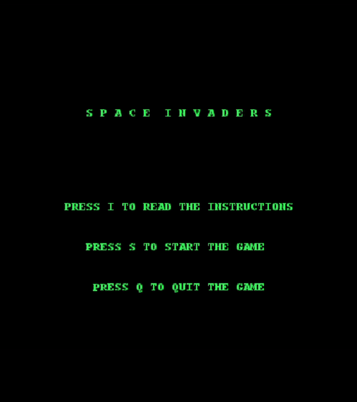

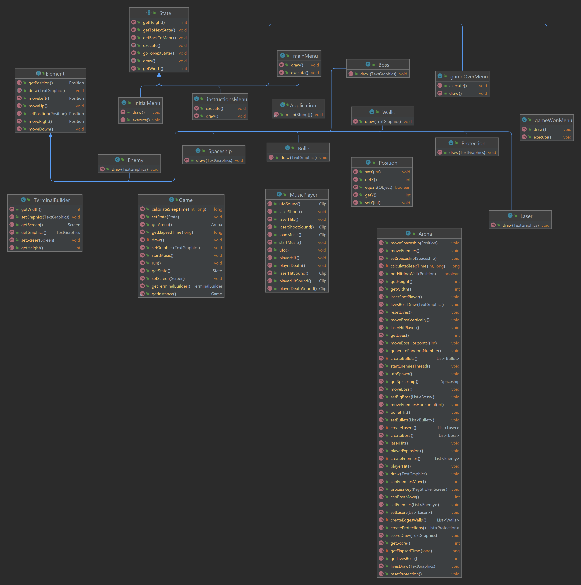

|            Menu Inicial             |           Instructions            |
|:-----------------------------------:|:---------------------------------:|
| 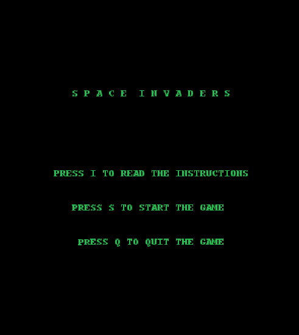 | 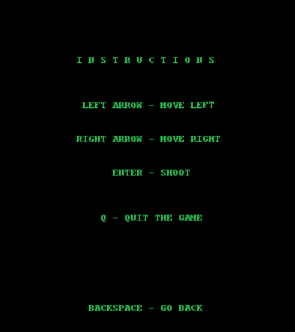 |

|             Game Win              |         Game Over         |
|:---------------------------------:|:-------------------------:|
| 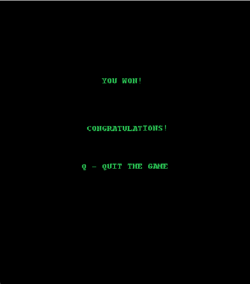 | 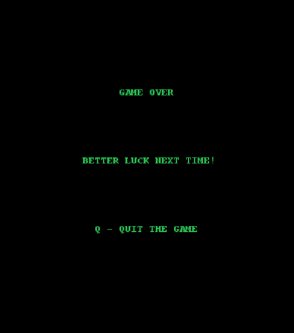 |

## Design Patterns
- **Composite :** Os elementos possuem atributos e métodos em comum entre si. O mesmo acontece com os menus.
- **State :** É usado para quando o comportamento de um objeto muda, ou seja, usado para os diferentes menus como o GameOver, quando a spaceShip fica sem vidas, e como o gameWon, quando o player elimina tanto os enemies como o Big Boss.
- **Model :** Guarda os diferentes elementos de todas as classes usadas no jogo.
- **View :** Lida com a interface gráfica que representa o jogo.

> Composite

**Contexto do Problema :** Implementamos este design pattern uma vez que vários objetos partilham os mesmos métodos e atributos.

  #### 1) Classe Element:
  Contém os atributos e métodos de uma personagem do jogo
  Subclasses - representam as diferentes personagens no jogo. São, portanto, extensões da classe principal:
  - Boss;
  - Bullet;
  - Enemy;
  - Laser;
  - Protection;
  - Spaceship;
  - Walls;

**Implementação :**

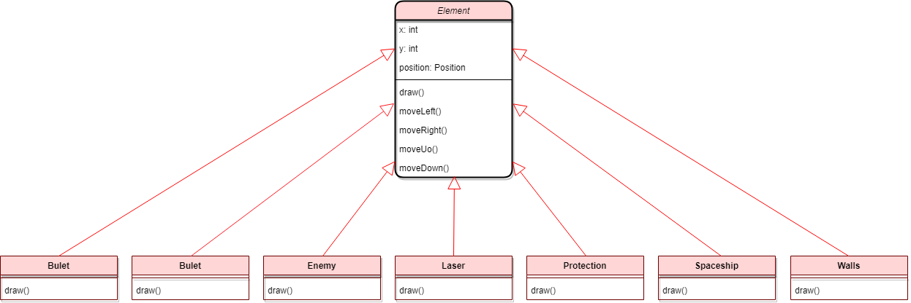

  ### 2) Classe State:
  Contém os atributos e métodos dos menus
  Subclasses - representam os diferentes menus. São, portanto,extensões da classe principal:
  - gameOverMenu;
  - gameWinMenu;
  - initialMenu;
  - instructionsMenu;
  - mainMenu;

**Implementação :**

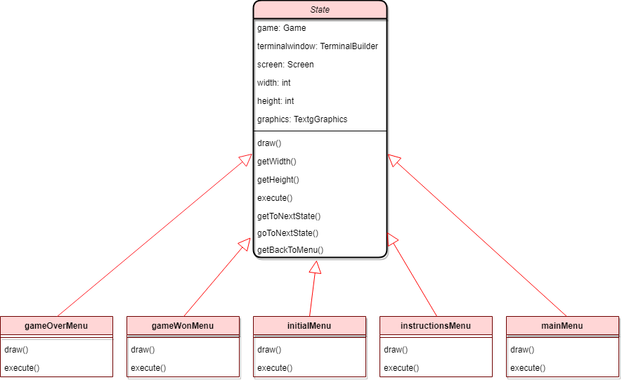

> State

**Contexto do Problema :** Alterar o estado da aplicação para vários estados diferentes (entre os menus e o jogo)

**Solução :** Implementamos o State Pattern que permite que um objeto altere o seu estado quando uma quando o seu estado interno muda
  
**Implementação :**

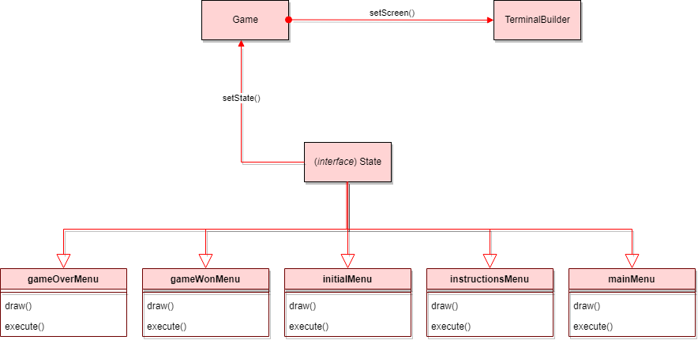

## Code Smells
  - **Large Class :** Este code Smell, refere se a uma class que tem muitas responsabilidades ou muito código. A class Arena tem vários métodos que podiam ser refatorados para obter um melhor design do código, como por exemplo passar os métodos de movimentos dos elementos para o Controller, e evitar assim que esta classe não seja dificil de manter e evoluir.

  

## Code Coverage

##### Screenshot do relatório de cobertura:

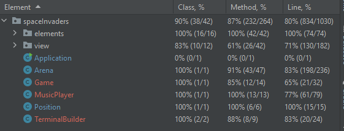

## PITEST

Pitest Link : http://localhost:63342/LDTS/build/reports/pitest/202212240418/index.html?_ijt=u8c2a0h6m0gv9vcr6t0rsc4ast&_ij_reload=RELOAD_ON_SAVE

- 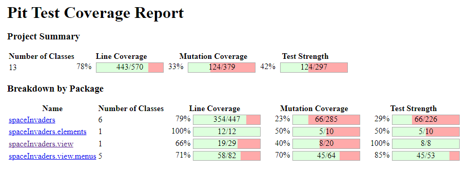

## Participação
  - **Carlota Silva :** 50%
  - **Samuel Oliveira :** 50%

